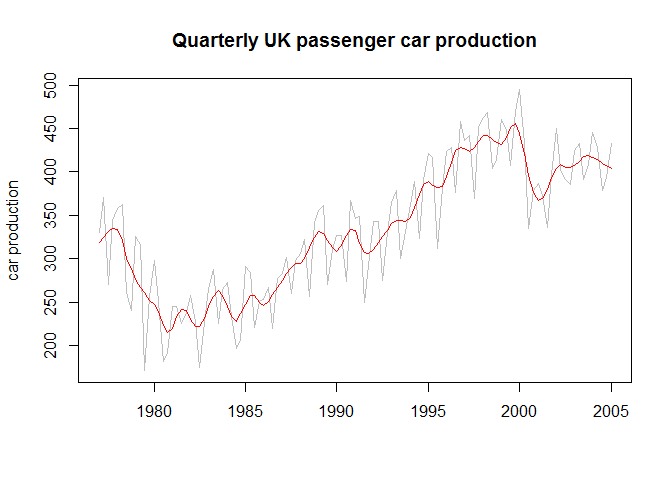
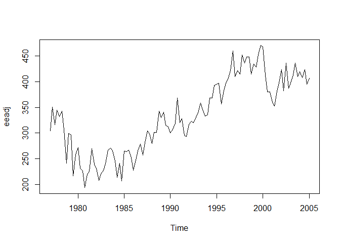
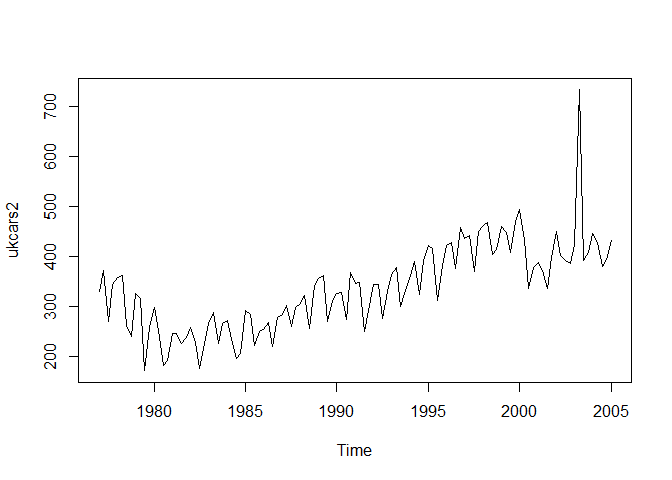
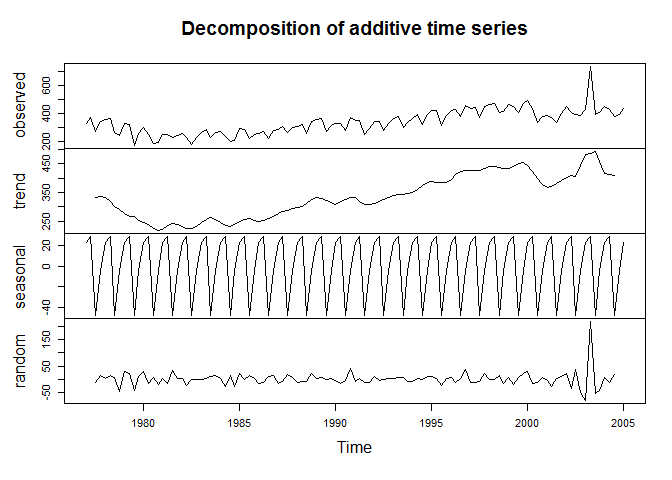
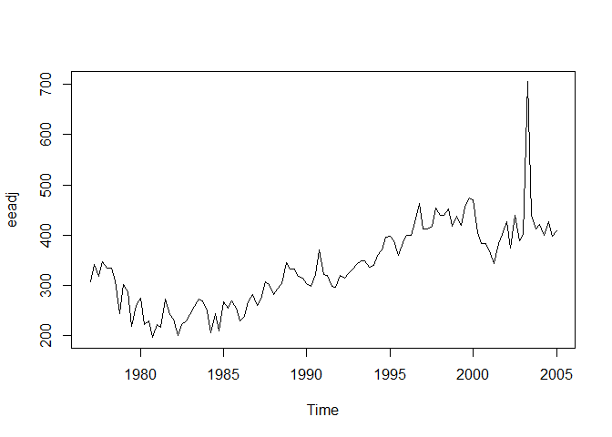
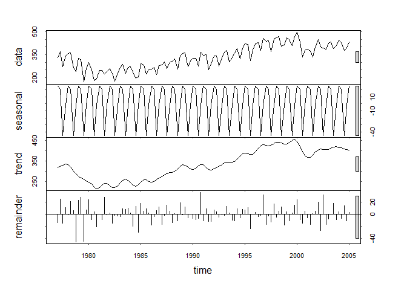
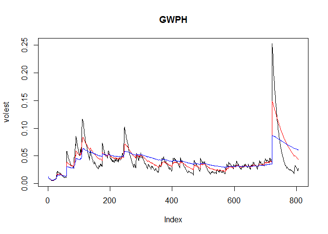

# Live Session 09 Assignment
Mike Martos  
July 13, 2016  


```r
library(fpp)
```

```
## Loading required package: forecast
```

```
## Loading required package: zoo
```

```
## 
## Attaching package: 'zoo'
```

```
## The following objects are masked from 'package:base':
## 
##     as.Date, as.Date.numeric
```

```
## Loading required package: timeDate
```

```
## This is forecast 7.1
```

```
## Loading required package: fma
```

```
## Loading required package: tseries
```

```
## Loading required package: expsmooth
```

```
## Loading required package: lmtest
```

```r
library(tseries)
```

###Question 1


```r
data(ukcars)
```

####	Plot the time series. Can you identify seasonal fluctuations and/or a trend? 

```r
plot(ukcars)
```

<!-- -->

####	Use a classical decomposition to calculate the trend-cycle and seasonal indices. 

```r
fitd <- decompose(ukcars)
plot(fitd)
```

<!-- -->

####	Do the results support the graphical interpretation from part (a)? 
##### The seasonality is confirmed

####	Compute and plot the seasonally adjusted data. 

```r
eeadj <- seasadj(fitd)
plot(eeadj)
```

<!-- -->

####	Change one observation to be an outlier (e.g., add 500 to one observation), and recompute the seasonally adjusted data. What is the effect of the outlier? 

```r
ukcars2 <- ts(c(ukcars[1:105],ukcars[106]-200+500,ukcars[107:113]),start=c(1977,1),frequency=4)
ukcars2
```

```
##         Qtr1    Qtr2    Qtr3    Qtr4
## 1977 330.371 371.051 270.670 343.880
## 1978 358.491 362.822 261.281 240.355
## 1979 325.382 316.700 171.153 257.217
## 1980 298.127 251.464 181.555 192.598
## 1981 245.652 245.526 225.261 238.211
## 1982 257.385 228.461 175.371 226.462
## 1983 266.150 287.251 225.883 265.313
## 1984 272.759 234.134 196.462 205.551
## 1985 291.283 284.422 221.571 250.697
## 1986 253.757 267.016 220.388 277.801
## 1987 283.233 302.072 259.720 297.658
## 1988 306.129 322.106 256.723 341.877
## 1989 356.004 361.540 270.433 311.105
## 1990 326.688 327.059 274.257 367.606
## 1991 346.163 348.211 250.008 292.518
## 1992 343.318 343.429 275.386 329.747
## 1993 364.521 378.448 300.798 331.757
## 1994 362.536 389.133 323.322 391.832
## 1995 421.646 416.823 311.713 381.902
## 1996 422.982 427.722 376.850 458.580
## 1997 436.225 441.487 369.566 450.723
## 1998 462.442 468.232 403.636 413.948
## 1999 460.496 448.932 407.787 469.408
## 2000 494.311 433.240 335.106 378.795
## 2001 387.100 372.395 335.790 397.080
## 2002 449.755 402.252 391.847 385.890
## 2003 424.325 733.280 391.213 408.740
## 2004 445.458 428.202 379.048 394.042
## 2005 432.796
```

```r
plot(ukcars2)
```

<!-- -->

```r
fitd <- decompose(ukcars2)
plot(fitd)
```

<!-- -->

```r
eeadj <- seasadj(fitd)
plot(eeadj)
```

<!-- -->

####	Does it make any difference if the outlier is near the end rather than in the middle of the time series? 
##### It depends, the model seems to "forget" about the outlier after some days, if it is very close to the the time window we are looking at then it has the more impact.

####	Use STL to decompose the series. 

```r
fit <- stl(ukcars, s.window="periodic")
plot(fit)
```

<!-- -->


```r
plot(ukcars, col="gray",
  main="Quarterly UK passenger car production",
  ylab="car production", xlab="")
lines(fit$time.series[,2],col="red",ylab="Trend")
```

<!-- -->

###Question 2

```r
SNPdata <- get.hist.quote('GWPH',quote="Close")
```

```
## Warning in download.file(url, destfile, method = method, quiet = quiet):
## downloaded length 50128 != reported length 200
```

```
## time series starts 2013-05-01
```
####Log return

```r
SNPret <- log(lag(SNPdata)) - log(SNPdata)
```
####Volatility 

```r
SNPvol <- sd(SNPret) * sqrt(250) * 100  #250 trading days
```


```r
## volatility
Vol <- function(d, logrets)
{
	var = 0
	lam = 0
	varlist <- c()
	for (r in logrets) {
		lam = lam*(1 - 1/d) + 1
  	var = (1 - 1/lam)*var + (1/lam)*r^2
		varlist <- c(varlist, var)
	}
	sqrt(varlist)
}
```


```r
volest <- Vol(10,SNPret)
volest2 <- Vol(30,SNPret)
volest3 <- Vol(100,SNPret)
plot(volest,type="l",main="GWPH")
lines(volest2,type="l",col="red")
lines(volest3, type = "l", col="blue")
```

<!-- -->


